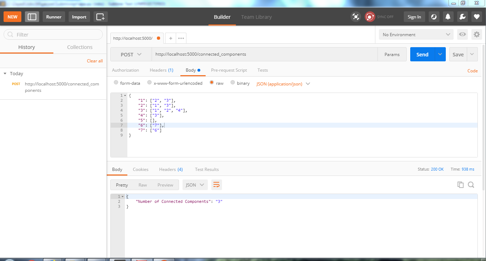
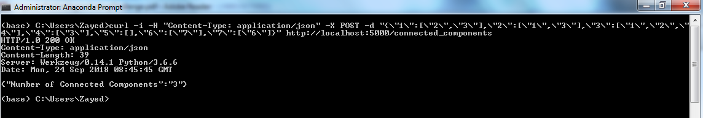

The web service has been set up using Flask - Python.

Tests have been performed on Postman and Curl as below.

> Note: On Windows, to test on Curl, back slashes and double qoutes are used with json POST data.

**Postman**

 

**Curl**

 

